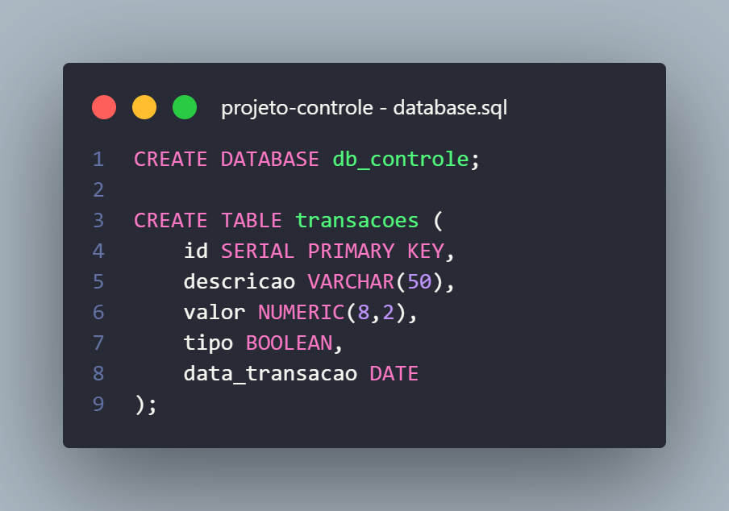
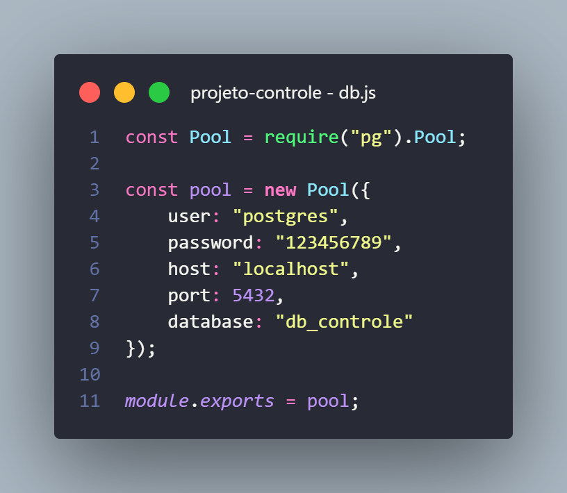

<H1>Projeto Controle de Finanças Pessoal</H1>

Aplicação de controle financeiro pessoal com Frontend, Backend e Banco de dados.  
Dispondo de recursos para Inclusão, Visualização, Edição e Exclusão de transações, além de visualizar o total de Entradas, Saidas e Saldo Liquido.
  
Este projeto é composto por: React-vite, react-icons, bootstrap 5, styled-components, express, cors e postgresql.

<H1>Como Utilizar:</H1>

    Ao baixar os arquivos, primeiro crie a sua base de dados.  
    Neste caso, a base de dados foi construida com o nome <i>db_controle</i>.
      
    
     
    Em seguida, é preciso configurar o seu banco de dados no arquivo <b><i>db.js</i></b>, encontrado na pasta <b>backend</b>!
      
    
     
    Defina seu usuario, senha e nome do banco de dados. (Aqui foi utilizado o login do super usuario 'porstgres').
      
    Após realizadas as modificações, execute dois consoles 'bash' e acesse as pastas <b>backend</b> e <b>frontend</b> em cada uma.
      
    Por fim, execute os comandos <b><i>nodemon index.js</i></b> para o <b>backend</b> e <b><i>npm run dev</i></b> para o <b>frontend</b>.

    <H2>Está pronto para uso!</H2>